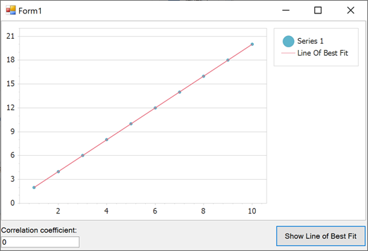

<!-- default badges list -->

<!-- default badges end -->

# How to Implement the Best Fit Function, and Apply it to a Chart's Series

This example shows how to perform a custom regression analysis against scatter series points generated from a data table and plot the line of best fit. 

To do so, follow the steps below:

- Create a point series (*Series 1* in this example) and [bind it to a data source](https://docs.devexpress.com/WindowsForms/6561/controls-and-libraries/chart-control/provide-data/specify-series-data-members). This series' data is to be analyzed.

- Add a line series (*Line Of Best Fit*) that is used to display the Line of Best Fit.

- Create a method that uses a custom formula to perform the regression analysis against the first series' points. The method should calculate data points used to plot the line series.

- In the [ChartControl.BoundDataChanged](https://docs.devexpress.com/WindowsForms/DevExpress.XtraCharts.ChartControl.BoundDataChanged?p=netframework) event handler, call the newly created method for the analyzed series (*Series 1*).

Note that you can also use built-in [Regression Lines](https://docs.devexpress.com/WindowsForms/6231/controls-and-libraries/chart-control/series/indicators/simple-indicators/regression-lines?p=netframework).

<!-- default file list -->
## Files to Look At

* [Form1.cs](./CS/LineOfBestFit/Form1.cs) (VB: [Form1.vb](./VB/LineOfBestFit/Form1.vb))
<!-- default file list end -->

## Documentation

* [Indicators](https://docs.devexpress.com/WindowsForms/8913/controls-and-libraries/chart-control/series/indicators) - This topic contains a list of built-in technical indicators that ship with the DevExpress Charts for WinForms.

## More Examples

* [How to display a regression line for a series](https://github.com/DevExpress-Examples/how-to-display-a-regression-line-for-a-series-e1494)
* [How to add a Trend Line to a chart](https://github.com/DevExpress-Examples/how-to-add-a-trend-line-to-a-chart-e1245)
* [How to draw Fibonacci Arcs, Fans and Retracement for a Stock series](https://github.com/DevExpress-Examples/how-to-draw-fibonacci-arcs-fans-and-retracement-for-a-stock-series-e966)